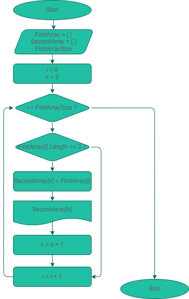

**Условие**: 

Написать программу, которая из имеющегося массива строк формирует массив из строк, длина которых меньше либо равна 3 символа.

---

**Решение**:

1. Задать длину первоначального массива
2. Задать значения массива с клавиатуры
3. Проверить длину каждого значения массива
4. Если длина значения меньше либо равна 3, то сохранить это значение в новый массив
5. Вывести новый массив на экран

---

**Блок-схема**

